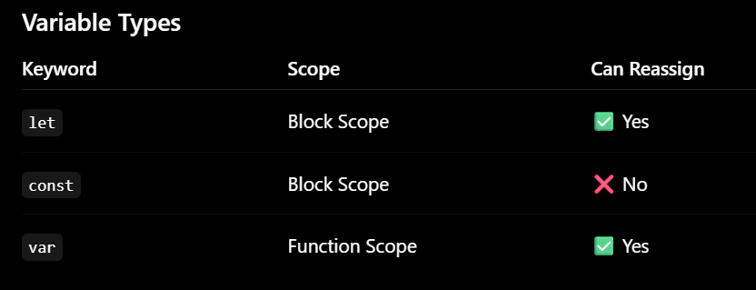
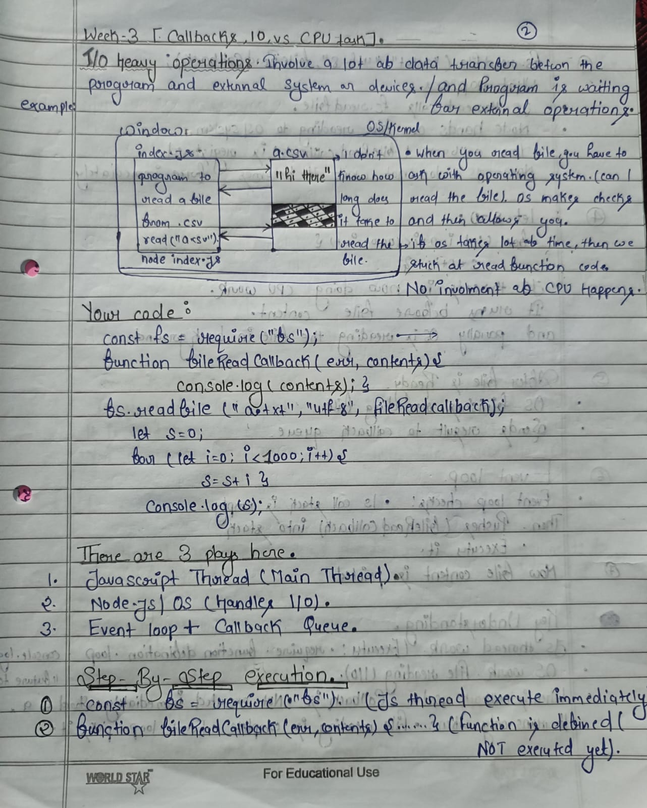
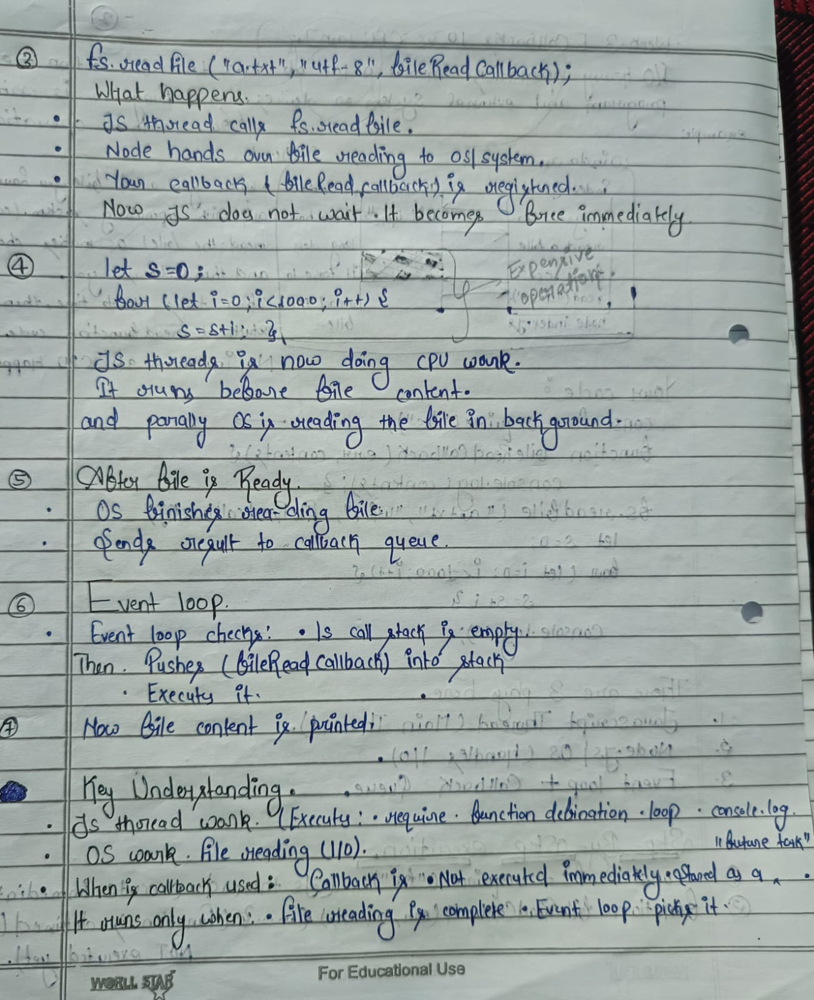
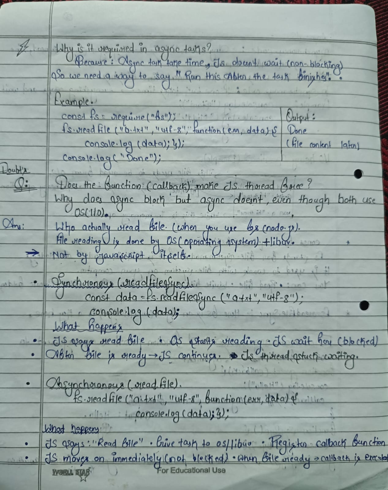
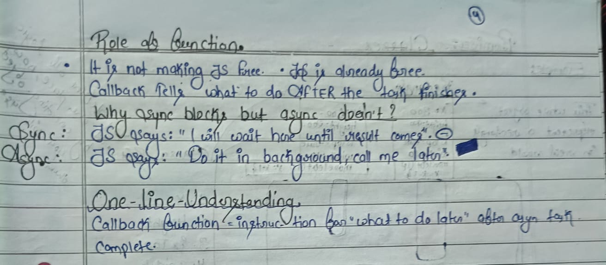

# 100x-dev-Bootcamp
Web dev and deveops bootcamp
# Week-2[JavaScript-Basics]
This file contains variables, data types, functions, loops, objects, arrays, and conditional statements.
📌 Topics Covered
Variables in JavaScript
Data Types
Functions
Loops
Objects
Arrays
Arrays of Objects
Conditional Statements

# Week-3[JavaScript File System & Async Programming Practice]
📌 Topics Covered
Normal Function in JavaScript
Synchronous Programming
Asynchronous Programming
Callback Functions
CPU and I/O bound task.

# Synchronus and Asynchronous / How callback handel Asynchronous programming.
## Image-1

## Image-2

## Image-3

