# 100x-dev-Bootcamp
Web dev and deveops bootcamp
# Week-2[JavaScript-Basics]
This file contains variables, data types, functions, loops, objects, arrays, and conditional statements.
📌 Topics Covered
Variables in JavaScript
Data Types
Functions
Loops
Objects
Arrays
Arrays of Objects
Conditional Statements

# Week-3[JavaScript File System & Async Programming Practice]
📌 Topics Covered
Normal Function in JavaScript
Synchronous Programming
Asynchronous Programming
Callback Functions
CPU and I/O bound task.

# Synchronus and Asynchronous / How callback handel Asynchronous programming.
## Image-1
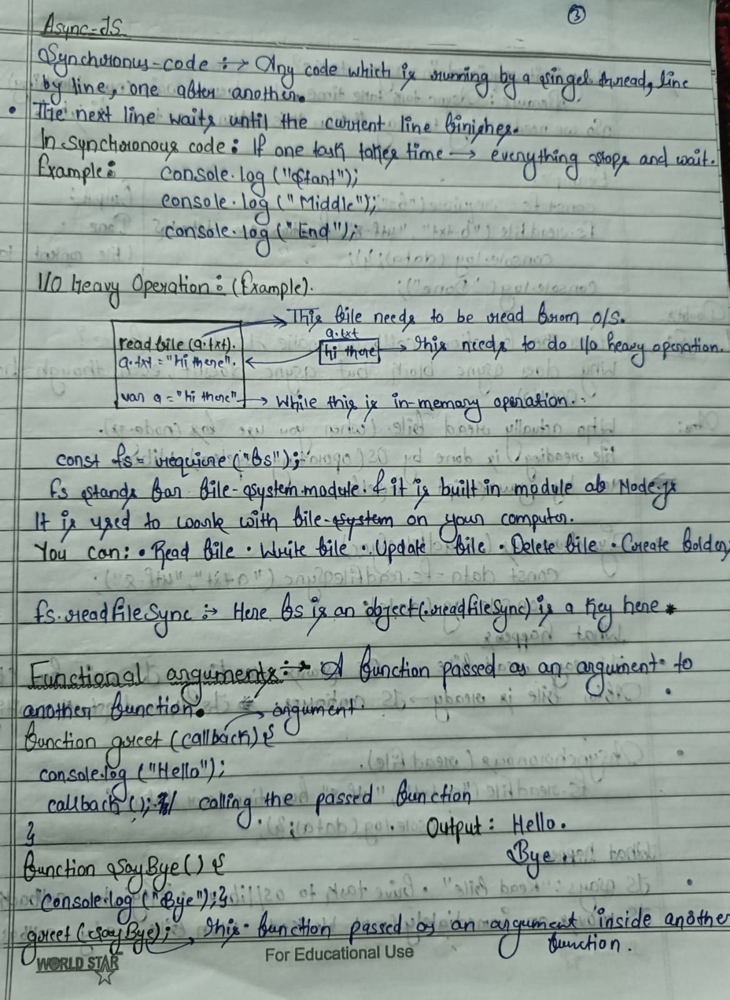
## Image-2

## Image-3

# Week-4[Classes in Js...Promises...Async and await...Practice Question...HOF...Strings]
 # Classes in Javascript.
 This file demonstrate Object-Oriented-Programming(OOP).
 In this we covered--Classes,Constructor,Inheritance,Super keyword.this keyword,Static method.
 This image cover the theory concept of the classes.
 # Image-1
 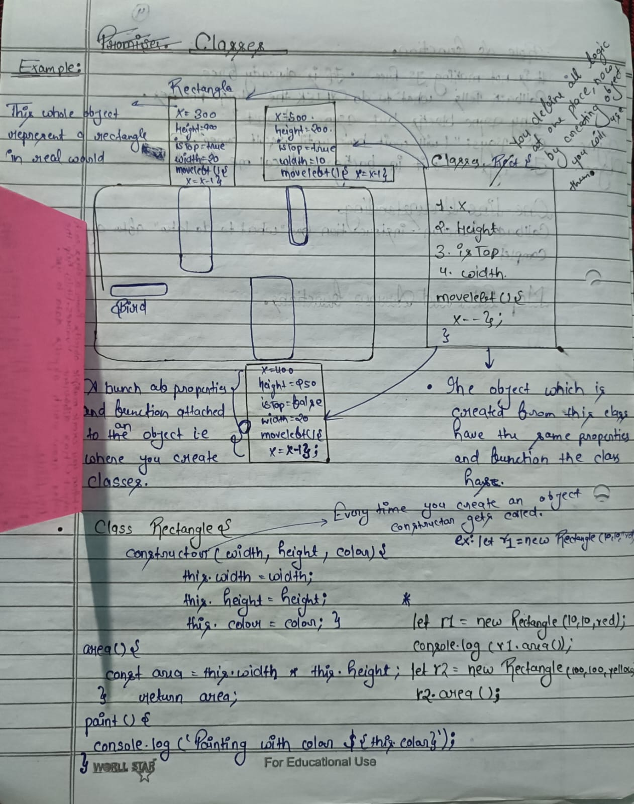
 # Image-2
 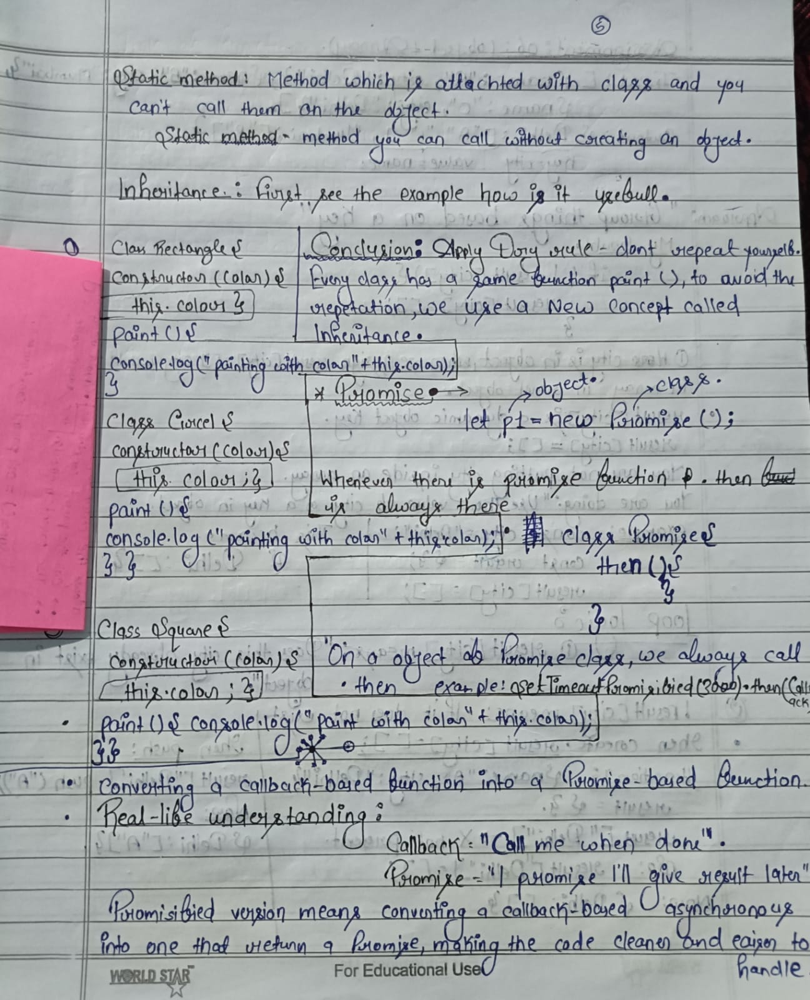

 # Promises in Javascript and File Handling.
 Synchronous vs Asynchronous file reading.......Callback functions
 Promises in JavaScript ....... Promisifying callback-based APIs
 setTimeout() with Promises........Callback Hell
 Promise chaining........Error handling using .catch().
 
 # Image-1:-[Explanation about how we write Promise and Handle async operations clearly]
 
 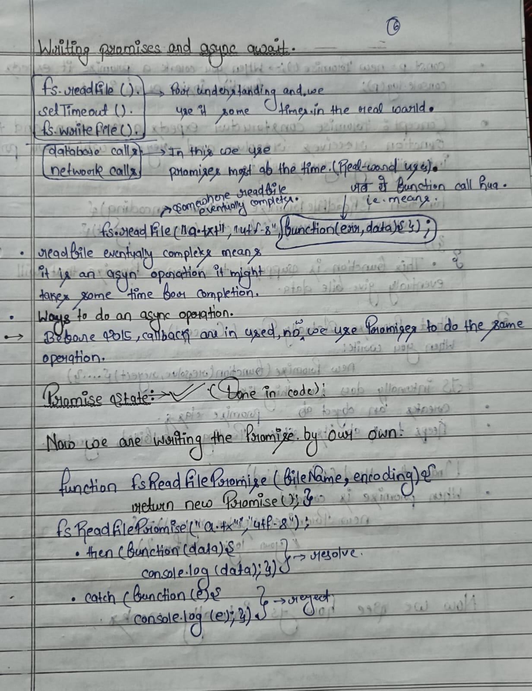

 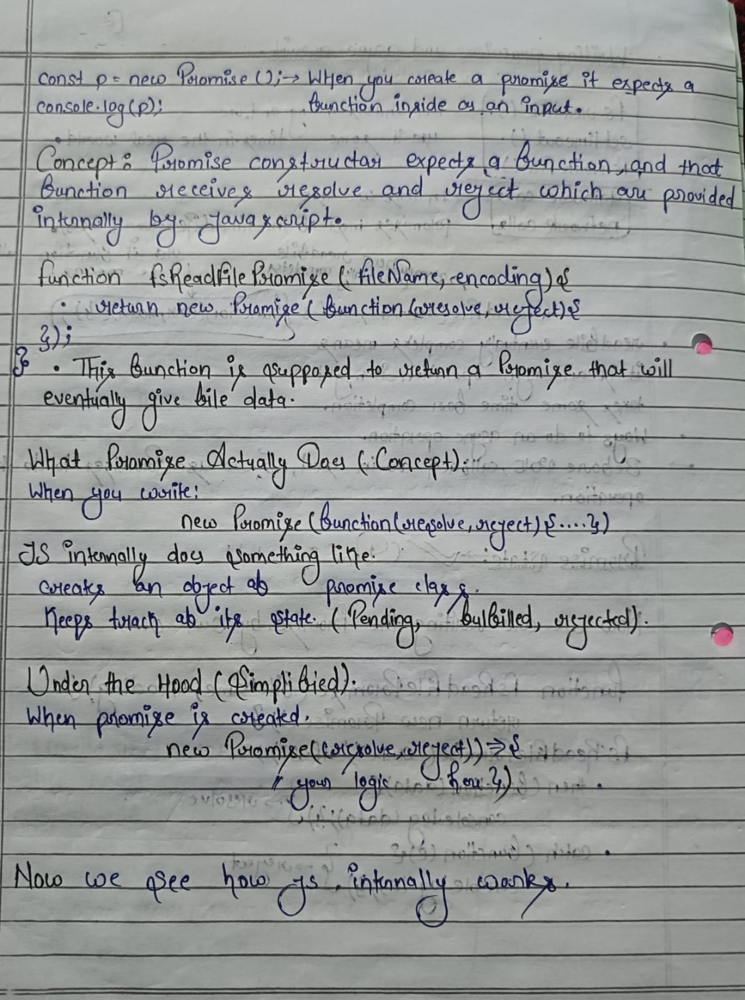

 # Image-2:-[How Promise internally works]
 
 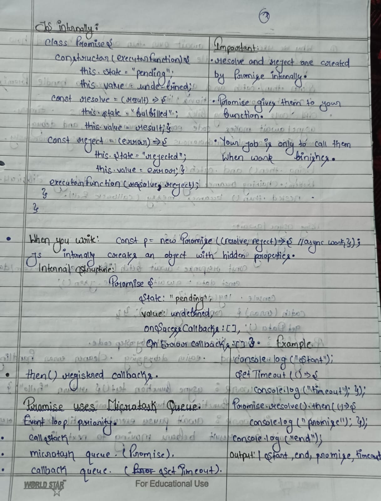

 ## How async await and [.then &.catch] works with Promise
 
 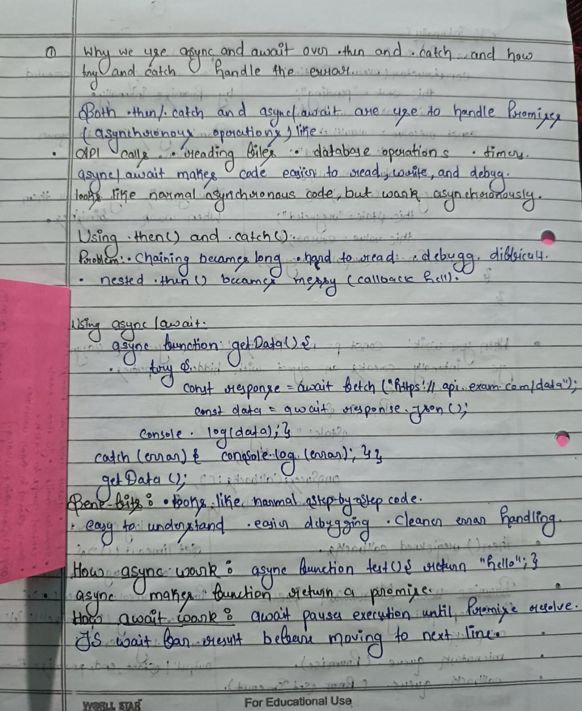

 # JavaScript DOM Manipulation and TODO-Practice.
 In the geaven code we learn about DOM..Where we fetch element,Update an element,Delete an element,Adding an element.
 There are four popular method for fetching an element.
 1-querySelector
 2-querySelectorAll
 3-getElementById
 4-getElementByClassName

# Handwriten explanation of DOM.
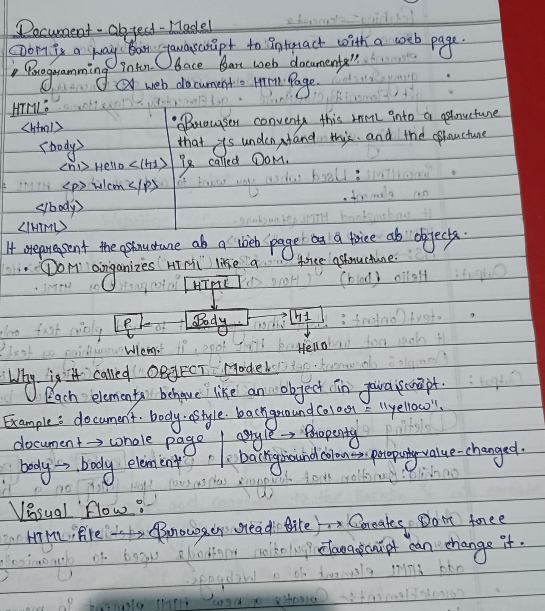

## Updating an Element.
You can update content inside HTML elements using.
innerHTML----Updates HTML content.
textContent----Updates only text.
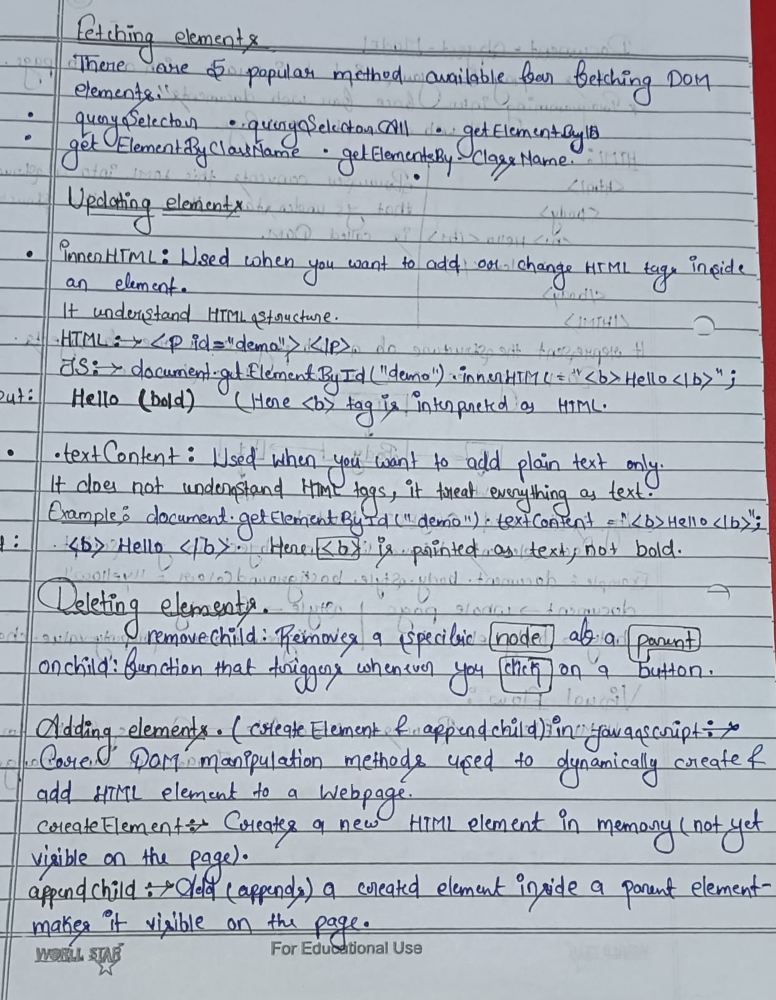

# State Derived Frontend
Instead of manually changing the DOM, we maintain a state and re-render UI from that state.
This is the core idea behind frameworks like:
React....Vue.js....Angular.
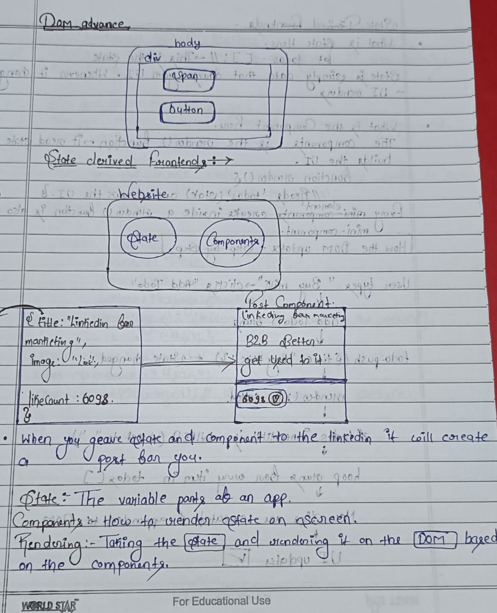
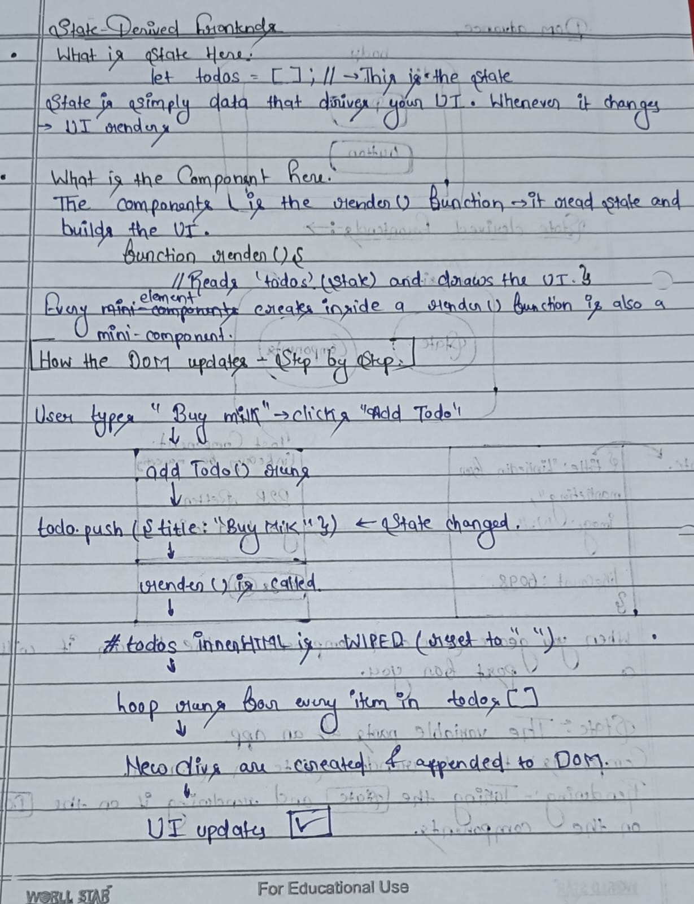
 

 
